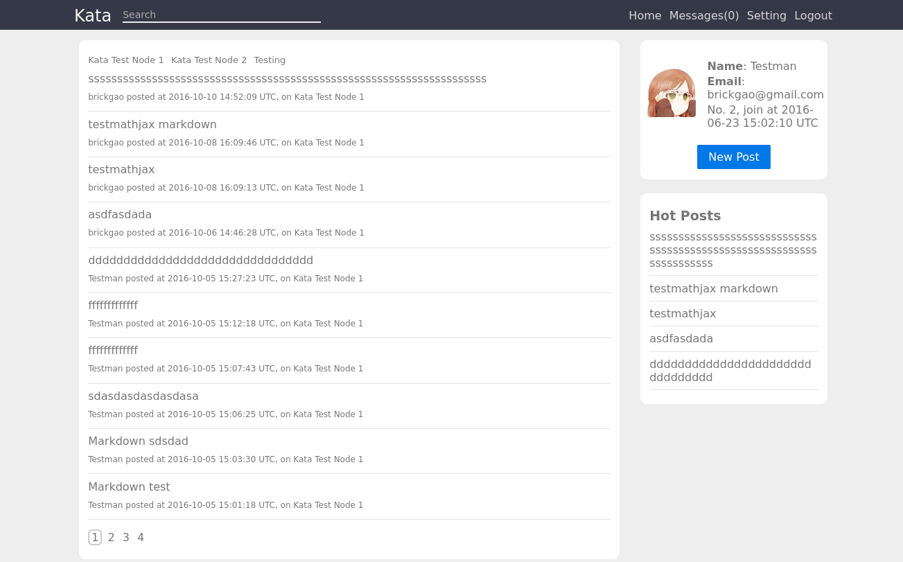
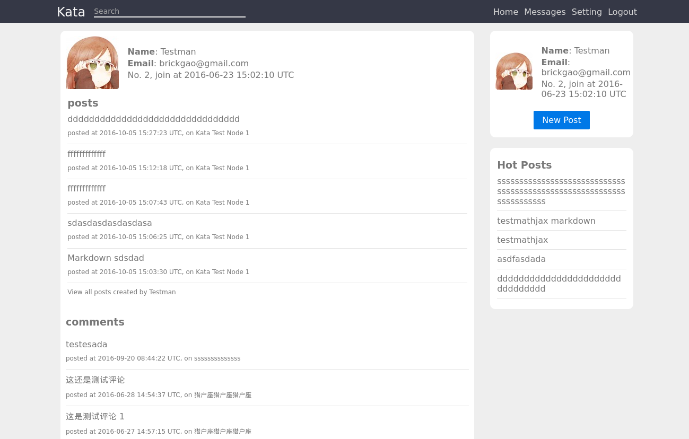
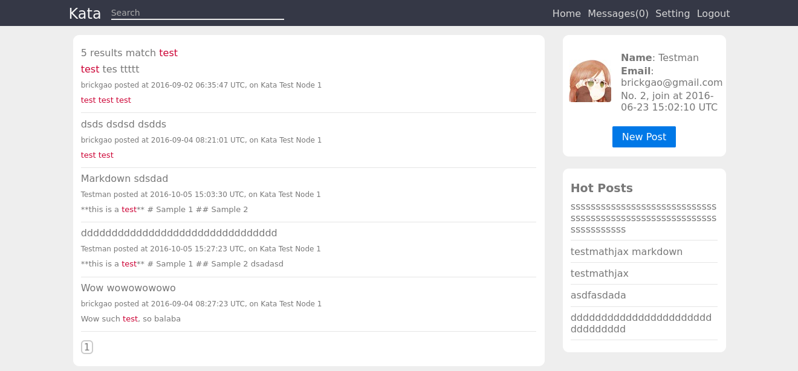

# Kata

[](https://travis-ci.org/brickgao/kata) [](https://coveralls.io/github/brickgao/kata?branch=master)

A kata for learning Ruby on rails.

## Install

Set up your MySQL, Redis and Elasticsearch, then:

```bash
$ RAILS_ENV="production" rake db:migrate
$ bundle install
$ RAILS_ENV="production" SECRET_KEY_BASE="YOUR_SERCET_KEY_BASE" SENTRY_DSN="YOUR_SENTRY_DSN" rails s Puma
```

If you would like to use Docker, install `docker` and `docker-compose`, then:

```bash
$ docker-compose build
$ docker-compose up
```

## Features

* Basic features related to users, e.g. signup, login, change your password or avatar.
* Make a post or a comment include gists, pictures and links. Posts also support Markdown's syntax.
* Send a message to other users, and start a chat.
* Use nodes to divide different type of posts.
* Get most popular posts in this forum.
* Search your post.

## Screenshots








## License

MIT
